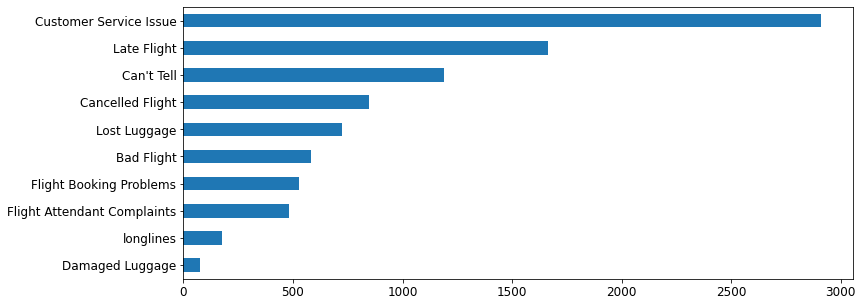
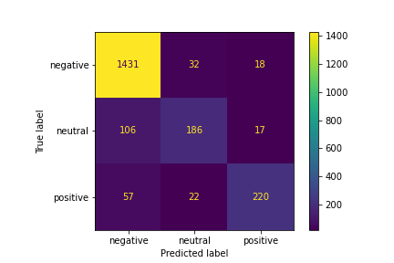

# Sentiment analysis of US Airlines tweets


# Overview

Interpreting and classifying opinions and emotions in subjective data is referred to as sentiment analysis. Sentiment analysis of customer experience is applied in various industries, such as finance, business, politics, and risk assessment. There are various machine learning, artificial intelligence, and deep learning techniques. In this project machine leargning models are created and configured for optimal predictive analysis of customers' tweets. Through an iterative modeling process, we produced a model that predicted negative tweets with 88% accuracy. By identifying tweets with negative sentiment, airlines can divert resources to the weak areas of customer satisfaction.

# Business Understanding

Social media can be used to gather insight in customer' satisfaction and it's fluctuation in different locations or periods of time. Collected data can be used to analyze the fedback and imporove servives and products.

Tweeter is a powerful source of information. Once extracted and processed data from tweeter can offer valuable insight for businesses regarding their performance.

Customer’s experience is an important issue for the air-travel industry in particular. Twitter is a popular platform for travellers to share their feedback. Airline companies invest time and resources to enhance customer loyalty. By exploring customer feedback, specifically negative feedback, airlines can allocate resources to the weak areas of customer satisfaction, increasing economic and social development of the company.

Without the use of machine learning and artificial intelligence, orthodox businesses spend hours of human effort completing manual annotations of tweets to group them into positive/negative sentiments, thus increasing the Time to insights. Moreover, errors that occur from humans can affect the manual text tagging accuracy, such errors can result from fatigue or overconfidence. However, computer aided Text Analysis (NLP) can reduce this time to a few minutes.

The goal of this project is to classify twitter data using machine learning and natural language processing (NLP) The tweets are categorized into neutral, positive, negative sentiments. With use of maching learning algorithms like LogisticRegression we  predict the correct clasification of tweets directed at different airlines, and then test the model on live tweets.

# Data

Dataset: The dataset is borrowed from Kaggle @ https://www.kaggle.com/crowdflower/twitter-airline-sentiment . The datafile is available in this repo in folder Data

Twitter data was scraped from February of 2015 and contributors were asked to first classify positive, negative, and neutral tweets. It contains 14,600 tweets directed at six airlines: Delta, Southwest, American, United, Virgin, and Us Airways.

# Problem

May 2022 had 2,413 complaints in US – It has doubled from last year metrics – according to airtravel consumer report published by Department of Transportation’s Bureau of Transportation Statistics Feedback that is available, generally lacks granularity, being generalized between customer service issue, Late or bad flight, or problems with luggage.

As you can see on this graph, based on the data we used for analysis, the top complaint by far is customer service, which ideally should be segmented into more subcategories to identify the precise issue beyond general customer service complaint.




# Preprocessing

-	To prepare our data we identified features that we would use. We explored the dataset and check how meaningful the content is and how much of it is missing. In this analysis most meaningful are names of the airline and the content of user tweets.  We then identified our target, which is positive, neutral, and negative sentiment. Then, we preprocess the data.

-	We removed username mentions, hyperlinks, signs , numbers, converting emoji to words, punctuation, using Python regex sub() function that lets you check if a particular string matches a given regular expression.

-	Changed emojis to words using Python Emoji module. The main purpose of emogi package is converting unicode emoji to emoji names and vice versa with emojize() and demojize(). Further information can be found here https://carpedm20.github.io/emoji/docs/

-	 Changed the words to the their base form using WordNetLemmatizer()

-  We used TfidfVectorizer to transform clean text to feature vectors that can be used as input to our estimator. TfidfVectorizer is chosen because it not only focuses on the frequency of words present in the corpus but also provides the importance of the words. It is subsequently tested in the beginning phase of modeling with different hyperparameters to select the best one.


# Model building

We explored several different methods and chose Logistic regression as our final model. Our Dummy classifier accuracy score was 54%. The test scores for Support Vector Classifier and Logistic Regression classifier were relatively close while Naive Bayes classifier score was lower. Initially, Logistic Regression classifier was at the top with 86.8% accuracy, the Support Vector Classifier had 84.8% accuracy, and the Naive Bayes classifier had 74.3% accuracy.

The performance of the models will vary depending on the preprocessing that took place. That’s why it was necessary to go back to preprocessing stage to tweak vectorizer parameters, and other preprocessing steps. Chosen vectorizer hyperparameters are max_df=2000 and min_df=10 in order to combat overfitting. Accuracy on cross validation is 0.876 compared to 0.868 seen previosly. 

For model tuning we used methods like gridsearh that tries different combinations of the hyperparameters to find the best performance. Using an iterative modeling process, we tuned our Logistic regression model using gridsearch focusing on finding the strongest regularization hyperparameter among L1, L2, and elasticnet, and C value to combat overfitting and increase accuracy. Our final accuracy score on tune logistic regression model was 88.2%


# Evaluating on live data

In order to scrape live tweets we will import package twitter (twitter - The minimalist yet fully featured Twitter API and Python toolset.) The Twitter API is documented at: https://dev.twitter.com/overview/documentation
Manual evaluation showed
a convincing degree of accuracy. Further manual evaluation and labeling would be neccesary in order to assign accuracy score on live tweets.
Developer account is needed in order to access live tweets.


# Results

The Logistic Regression classifier was our strongest performing model with accuracy score 88%

Correctly predicted 96% of Negative

163 out of 2089 of negative tweets is missclasified

Correctly predicted 73% of Positive

Correctly predicted 60% of Neutral




# Conclusion

Our model can be used to identify negative tweets for further exploration and analysis. With access to larger corpus of tweets further steps can be taken to analyze most frequent and meaningful words that occur in tweets that express negative sentiment. Those words would be indicative of the reason for customers dissatisfaction.

Additional analysis is required to assess significance of the words that are frequent in tweets expressing negative sentiment. Further steps would include aggregating that data and analyzing the words in negative tweets.

This project provides a tool that airlines can use to identify negative tweets. By exploring customer's negative feedback, companies can allocate resources to the weak areas of customer satisfaction.

Here are some areas for further investigation to produce an improved model:

- Improve model performance on Positive and Neutral labels: More relevant and balanced data is required.

- Train model on current data in order to improve its' performance on current tweets.

## Repository Structure

```
├── Data
│   └── Tweets.csv
├── Visualizations
│   ├── confusion.png
│   └── reason1.png
├── README.md
├── Final_notebook.pdf
└── presentation_nlp_tweets.pdf 
```
